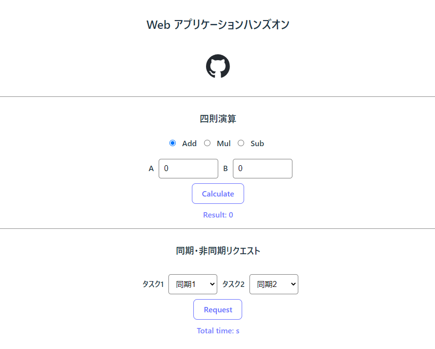

# Webアプリケーションハンズオン
## 概要
FastAPIによるバックエンドサーバーとVue3 + Viteによるフロントエンドサーバーのデモを実施するためのリポジトリです.




## 動作環境
### Python
v3.11.4
### Node.js
v18.16.1(npm v9.5.1)

## 各サーバーの使用方法
### バックエンド(FastAPI)
[backend](https://github.com/takenaka-ai/webapp-handson/tree/main/backend)を参照

### フロントエンド(Vue3 + Vite)
[frontend](https://github.com/takenaka-ai/webapp-handson/tree/main/frontend)を参照

## コンテナの利用について
docker-compose.yamlを作成していますので
下記により両サーバーの実行が可能です.
(あんまり詳しくないので書き方おかしければ指摘してください)

```shell
docker-compose up -d
```
